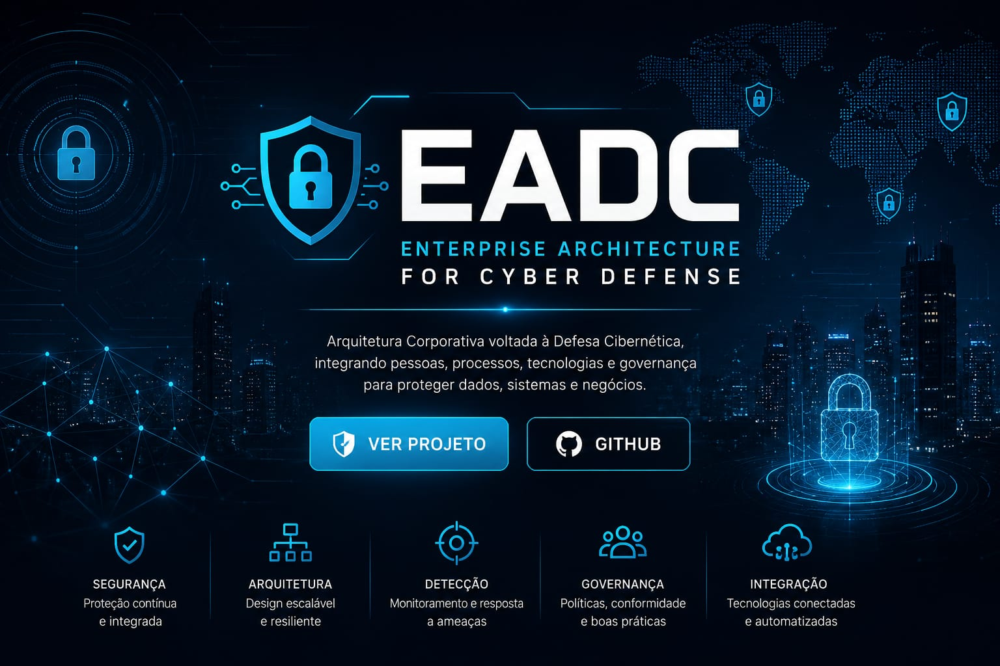

# EADC Framework 1.0

## Enterprise Architecture for Cyber Defense

O EADC Framework 1.0 é um framework acadêmico desenvolvido para demonstrar uma arquitetura corporativa voltada à Defesa Cibernética.

O projeto integra conceitos de:

- Arquitetura Empresarial
- Segurança da Informação
- DevSecOps
- Cloud Computing
- Inteligência Artificial
- Governança de TI

---

## Objetivos

- Demonstrar uma arquitetura de defesa cibernética.
- Aplicar boas práticas de Engenharia de Software.
- Integrar tecnologias modernas.
- Servir como portfólio acadêmico e profissional.

---

## Arquitetura

O framework é composto pelos seguintes pilares:

- Segurança
- Cloud Computing
- Inteligência Artificial
- Governança de TI

---

## Tecnologias

- Python
- Java
- Docker
- Linux
- HTML5
- CSS3
- JavaScript
- MySQL
- Git
- Kali Linux
- Microsoft Azure
- Amazon Web Services (AWS)

---

## Funcionalidades

- Estrutura de arquitetura corporativa
- Organização modular
- Interface web responsiva
- Documentação técnica
- Demonstração de conceitos de Defesa Cibernética

---

## Demonstração

GitHub Pages:

https://didigo207.github.io/EADC/

---

## Autor

**Heverton Diego Paiva de Oliveira**

Graduado em Análise e Desenvolvimento de Sistemas.

Projeto desenvolvido como portfólio acadêmico e profissional.

---

## Licença

Projeto desenvolvido para fins acadêmicos e de demonstração.
